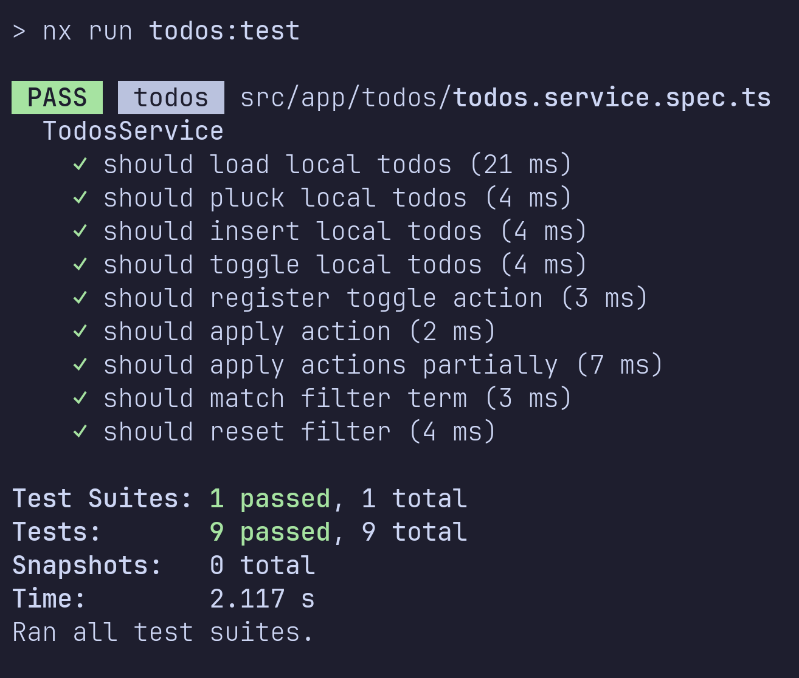
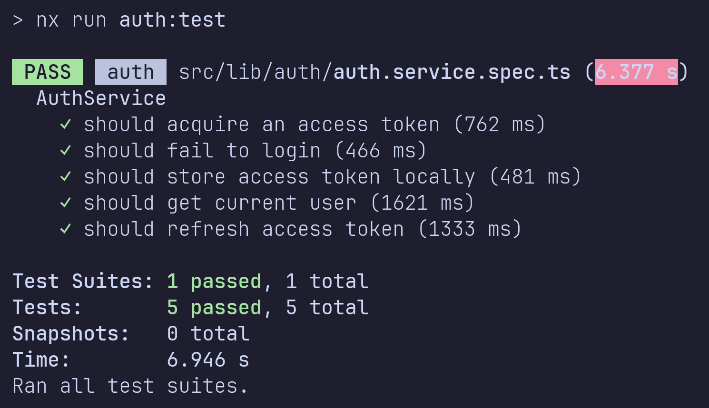

# Todos+

### Prerequisites

1. [Node.js v22](https://nodejs.org/en)
2. [Yarn Package Manager](https://yarnpkg.com/)
3. [Nx CLI](https://nx.dev/)

### Starter Guide

1. Clone repository

```sh
git clone git@github.com:solomancode/whitehelmet.git
```

2. Install dependencies

```sh
cd whitehelmet
yarn install
```

3. Run todos app

```sh
cd apps/todos
nx serve
```

4. Runing tests

- Navigate to app./lib dir and run

```sh
nx test
```

#### Login Details

| username | password   |
| -------- | ---------- |
| emilys   | emilyspass |

### Troubleshooting

> Error: ENOSPC: System limit for number of file watchers reached

```sh
sudo sysctl fs.inotify.max_user_watches=524288
```

#### Does the application meet all specified requirements?

- [x] Implement login functionality
- [x] Use Angular's HttpClient to communicate with a backend API
- [x] Use route guards to protect routes that require authentication.
- [x] Display the Todo list for the logged-in user.
- [x] Use Angular Material components for a polished UI.
- [x] Create a dedicated route to view detailed information about a specific task
- [x] Display task attributes
- [x] Task Creation, Editing and Delete
- [x] Provide forms for creating new Todos
- [x] Provide forms for editing existing ones.
- [x] Include validation for required field
- [x] Use the Angular Component Dev Kit (CDK) to implement drag-and-drop
- [x] Allow users to change task status by dragging tasks between columns
- [x] Use NgRx, Angular Signals, or Behavioural subject to manage the application state.
- [x] Define actions, reducers, and effects to handle task data and user authentication state.
- [x] Ensure state updates are efficient and predictable.
- [x] Use the latest Angular version (as of assignment time).
- [x] Follow a modular architecture with feature module.
- [x] Implement services for API communication (e.g., UserService).
- [x] Ensure a responsive and accessible design.
- [x] Include intuitive navigation with Angular Router.
- [x] Show loading indicators during API calls.
- [x] Create a login page using the api/login API.
- [x] Store the JWT token securely (e.g., session storage).
- [x] Restrict access to certain routes based on authentication.
- [x] Handle API errors gracefully and display meaningful messages.
- [x] Validate forms for required fields and proper formats.
- [x] Use lazy loading for improved performance.
- [x] Create a mobile-friendly design with responsiveness in mind.
- [x] Use Angular animations for a smooth user experience.
- [x] Use TypeScript features like interfaces and enums to define data models

- **Bonus Requirements**
- [x] Add unit tests for critical components and services.
- [x] Cover key functionality and edge cases in the tests.

---

### Due to time constraints, The following points might need further improvements:

1. **Use Angular animations for a smooth user experience.**

Might need to add custom animations on top of Angular components built-in animations

2. **Task Creation, Editing and Delete**

Task creation and editing has been implemented, Delete can be implemented by extending api service and modifying TodoComponent ui for todo deletion

3. **Define actions, reducers, and effects to handle task data and user authentication state**

Most of the required key features for handling user auth is implemented using services and signals. Auto-login and Auto-refresh token can be implemented by extending auth lib. and the provided http interceptor.

4. **PI Integration: Correct and efficient integration of APIs, and Implementation of pagination, sorting, and filtering**

Loading, editing, creating and filtering todos are implemented but sorting and pagination can be implemented by extending api service to fetch specific pages, fetch sorted and ui components for infinite scrolling and sorting controls

---

#### Is the code clean, well-organized, and following Angular best practices?

Yes, Api, auth, local-storage, and ui functionality are separated into 4 different libraries and consumed by todos app

#### Is the application structured in a scalable and maintainable way?

Yes, Each of the mentioned libraries can be extended for future requirements

#### Performance: Does the application perform efficiently, especially with large task lists?

Yes, A virtual list was used and tested to smoothely render up-to 1e5 todos

#### UI/UX and Accessibility: Ensure responsive design, maintain theme consistency, and create a visually appealing and accessible user interface.

Yes, Basic responsive styling was implemented but might need testing on different devices

#### API Integration: Correct and efficient integration of APIs, and Implementation of pagination, sorting, and filtering.

Mostly yes, Review previous section point 4.

#### Security (bonus): Are common vulnerabilities prevented?

Only input validation and built-in angular security measures. **Can be improved**

#### Testing (bonus): Are there sufficient tests to ensure correctness?

Yes.14 tests covering critical features




#### Documentation: Is the setup process clear and well-documented?

Refer to section 1

### Additional Notes

This is one way of building a Todo app, and it isn't necessarily the perfect way. Depending on the circumstances, I would build it using different approaches.

👋 Thank you.
